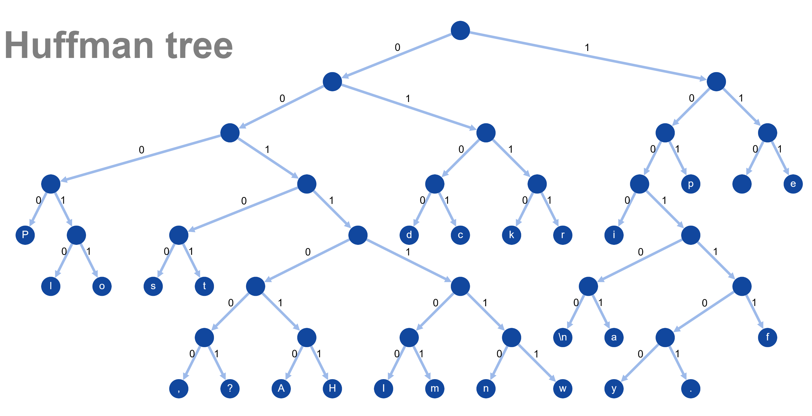

# Huffman Encoding and Decoding

## Description
This repository contains a C-based implementation of Huffman coding for text compression and decompression. The program constructs an optimal binary tree to represent character frequencies, enabling efficient encoding and decoding of text. This tool showcases the power of algorithm design and memory-efficient data structures for real-world applications like data compression.

### Tree Building
- A frequency table is generated by scanning the input text.
- A priority queue is used to construct the Huffman tree. Nodes with the lowest frequencies are merged iteratively until a single root node remains.

### Encoding Algorithm
- The Huffman tree is traversed recursively to assign binary codes (0 for left and 1 for right) to each character.
- The input text is encoded by replacing each character with its corresponding binary code.

### Decoding Algorithm
- The encoded binary sequence is traversed using the Huffman tree.
- Starting from the root, the path is followed (0 for left, 1 for right) until a leaf node is reached, which represents a character.

## Example Tree of Peter Piper



## Usage
Clone the repo then follow these steps:

### 1. Compile the Program
Run `make` to compile the program using the provided Makefile.

### 2. Construct the Huffman Tree
```bash
./encode INPUT_TEXT_FILE.txt OUTPUT_TREE_FILE_NAME.tree
```

### 3. Encode the Text
```bash
./encode INPUT_TEXT_FILE.txt TREE_FILE.tree OUTPUT_ENCODED_FILE_NAME.enc
```

### 4. Decode the Text
```bash
./decode TREE_FILE.tree ENCODED_FILE.enc OUTPUT_TEXT_FILE_NAME.txt
```

### 5. Visualise a Huffman Tree
```bash
./treePrinter INPUT_TREE_FILE.tree tree-vis/OUTPUT_FILE_NAME.html
```
Then open the HTML file your browser.